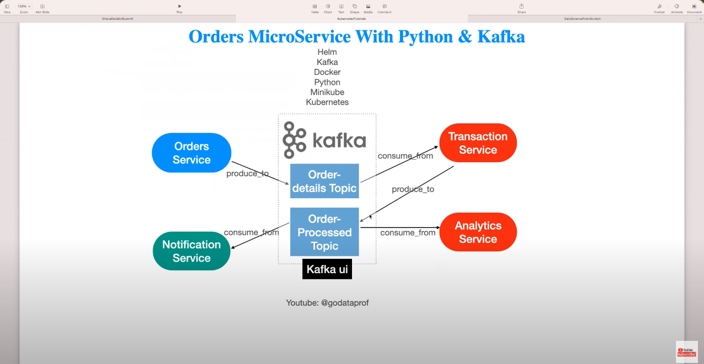

# Apache Kafka with Kubernetes

#### To be able to develop this project we'll need some tools to be installed in our machine. The tools are:
- [x] **docker**  ([kubectl Installation](https://docs.docker.com/engine/install/ubuntu/))
- [x] **kubectl**  ([kubectl Installation](https://kubernetes.io/docs/tasks/tools/install-kubectl-linux/))
- [x] **minikube**  ([kubectl Installation](https://minikube.sigs.k8s.io/docs/start/?arch=%2Flinux%2Fx86-64%2Fstable%2Fbinary+download))

#### You can optionally use some useful tools for debugging and monitoring kubernetes:
- [x] **k9s**  ([kubectl Installation](https://k9scli.io/topics/install/))
- [x] **kafka-ui**  ([kubectl Installation](https://github.com/provectus/kafka-ui))

#### Schema of the practise project
